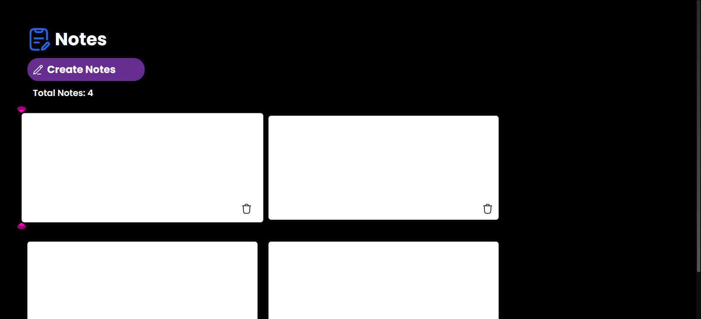

# 📝 Notes App

A simple **Notes Application** that allows users to create, edit, and delete notes. All notes are stored in the browser using **Local Storage**, so they remain available even after refreshing the page.

## 📸 Preview

## 🚀 Key Features

Create Notes: Instantly generate new editable notes.
Edit Notes: Modify notes directly using `contenteditable`.
Delete Notes: Remove notes with a single click.
Persistent Storage: Notes are saved using Local Storage.
Live Counter: Displays the total number of notes.

## 🛠️ Tech Stack

HTML5: Semantic structure.
CSS3: Styling and layout.
JavaScript: DOM manipulation and event handling.
Local Storage: Data persistence in the browser.

## 🧠 Learning Outcomes

Improved understanding of DOM manipulation and event delegation.
Learned how to store and retrieve data using Local Storage.
Built dynamic UI elements using JavaScript.